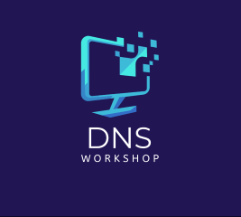

## A practical guide through the domain name system of the Internet. 

#### Module 1: DNS from First Principles
1.1 DNS as a Database  
1.2 DNS Structure  
1.3 Zone Delegation  
1.4 The Root Zone  
1.5 Authoritative DNS Servers  
1.6 Zone Transfer  
1.7 Using dig and nslookup  

#### Module 2: Domain Names
2.1 TLDs and ccTLDs  
2.2 Domain Hierarchy  
2.3 Registries vs Registrars  
2.4 ICANN Oversight  
2.5 WHOIS and RDAP  
2.6 Internationalized Domain Names (IDNs)  
2.7 Domain Lifecycle  
2.8 Domain Transfer  

#### Module 3: Operational DNS
3.1 Recursive Queries  
3.2 Glue Records  
3.3 DNS Caching and TTL  
3.4 Negative Caching  
3.5 DNS Protocol  
3.6 EDNS (Extension Mechanisms for DNS)  
3.7 Transport Protocols (UDP, TCP, DoH, DoT)  
3.8 Public Resolvers  
3.9 Dynamic DNS (DDNS)  
3.10 Dynamic DNS Responses  

#### Module 4: Types of DNS Records
4.1 A and AAAA Records  
4.2 CNAME Records  
4.3 TXT Records  
4.4 SRV Records  
4.5 PTR Records  
4.6 NS Records  
4.7 SOA Records  
4.8 DNSSEC-Related Records (DNSKEY, RRSIG, DS, NSEC)  
4.9 TLSA Records for DANE  
4.10 ANY Queries and Record Aggregation  

#### Module 5: Email and DNS
5.1 MX Records  
5.2 SPF Records  
5.3 DKIM  
5.4 DMARC  
5.5 DANE  
5.6 MTA-STS  
5.7 BIMI  

#### Module 6: Debugging DNS Issues
6.1 Cache Invalidation  
6.2 Inspecting DNS Traffic  
6.3 Simulating Failures  
6.4 Lame Delegation  
6.5 DNSSEC Validation Errors  
6.6 Root Cause Analysis  
6.7 Graceful DNS Changes  